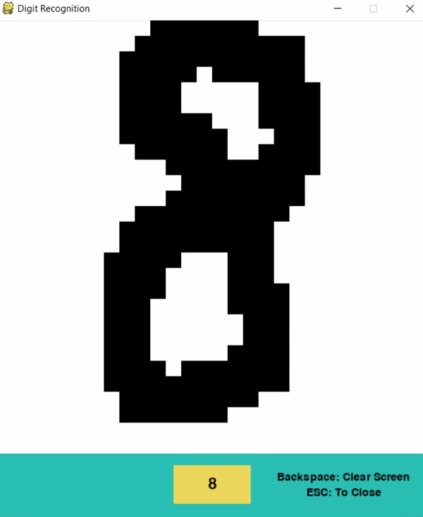

# Digit-Recognition-System
- **Description:**

The deep learning model is trained on [MNIST digit dataset](https://www.kaggle.com/c/digit-recognizer/data) and stored which is used in another file GUI Interface.py for acquiring output. I have developed a GUI using Pygame to give project a nice and sound look and even user friendly. 

-	**Technologies used:** Python, Tensorflow, Scikit Learn, Pygame (GUI).

### Check output:

